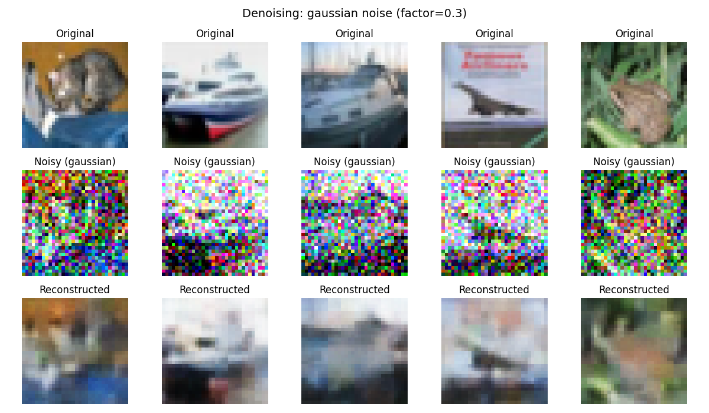
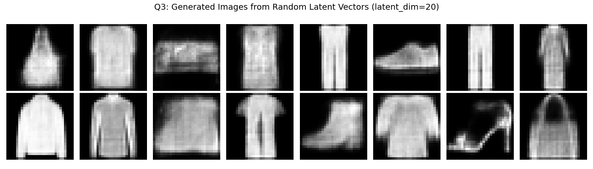
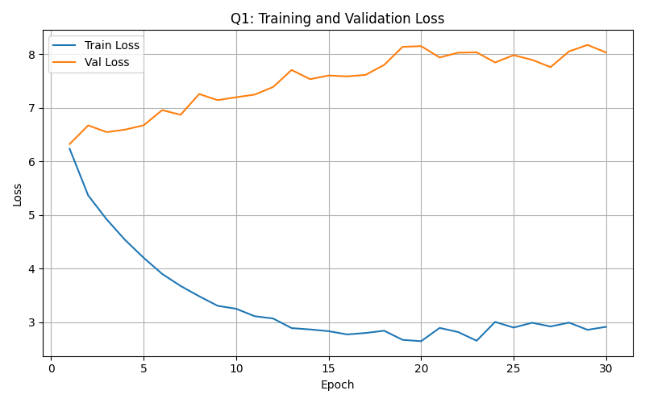

# PyTorch Generative Models

A from-scratch study of three core neural architectures, each built in plain PyTorch without leaning on high level wrappers. The project covers a sequence-to-sequence translator, a convolutional denoising autoencoder, and a variational autoencoder. Every model is implemented, trained, tuned, and evaluated end to end, and the findings are written up as a research style report in Springer LNCS format.

This was produced for the Generative AI course at the National University of Computer and Emerging Sciences, Islamabad.

## What is inside

| Part | Task | Architecture | Dataset |
| --- | --- | --- | --- |
| Q1 | English to Urdu machine translation | Vanilla RNN encoder-decoder (no LSTM, GRU, or Transformer) | English-Urdu parallel corpus, about 24k pairs |
| Q2 | Image denoising | Convolutional denoising autoencoder | CIFAR-10 |
| Q3 | Image generation | Variational autoencoder with the reparameterization trick | Fashion-MNIST |

## Highlights

- A complete seq2seq pipeline written by hand: word level tokenization, vocabulary construction with special tokens, padding and masking, teacher forcing, and both greedy and beam search decoding.
- Grid search over embedding size, hidden dimension, layer count, learning rate, dropout, and batch size, with the selected configuration justified in the report.
- A symmetric encoder-decoder denoiser trained against both Gaussian and salt-and-pepper noise, evaluated with MSE, PSNR, and a manual SSIM implementation.
- A VAE with a clean separation of reconstruction loss and KL divergence, plus an experimental study on how the latent dimension affects reconstruction quality and sample diversity.
- BLEU scoring, reconstruction metrics, training curves, and qualitative examples are all generated by the code and archived under `results/`.

## Repository layout

```
.
├── src/
│   └── solution.py          Full implementation for all three questions
├── report/
│   ├── report.tex           LNCS source for the technical report
│   └── report.pdf           Compiled report
├── prompts/
│   └── prompts.txt          Prompts used while developing each question
├── results/
│   ├── q1/                  Translation training curve and example outputs
│   ├── q2/                  Denoising visualizations and noise-level study
│   └── q3/                  Generated samples, reconstructions, latent study
├── docs/                    Per-question overviews and demo preparation notes
├── assignment/              Original brief, rubric, and plain text spec
├── best_q1_model.pt         Trained Q1 checkpoint (inference skips retraining)
├── requirements.txt
└── LICENSE
```

## Getting started

Set up a virtual environment and install the dependencies.

```bash
python -m venv .venv
# Windows
.venv\Scripts\activate
# macOS or Linux
source .venv/bin/activate

pip install -r requirements.txt
```

A CUDA capable GPU is recommended for Q1 training, though the code falls back to CPU automatically.

## Running

The entry point lives in `src/solution.py`. Run everything, or pick individual questions by passing their numbers.

```bash
# Run all three questions
python src/solution.py

# Run only Question 1
python src/solution.py 1

# Run Questions 2 and 3
python src/solution.py 2 3
```

Notes on behavior:

- Q1 looks for `best_q1_model.pt` at the repo root. Since the trained checkpoint ships with this repository, the grid search and training step are skipped and the model goes straight to evaluation. Delete the checkpoint to retrain from scratch.
- The CIFAR-10 and Fashion-MNIST datasets download automatically into a local `data/` folder on first run.
- The Q1 parallel corpus is fetched through `kagglehub`. If that fails, place the dataset CSV as `english_urdu.csv` at the repo root and rerun.
- Figures and text outputs are written to the working directory when you run the code. The curated copies committed here live under `results/`.

## Results at a glance

A few representative outputs are shown below. The full quantitative tables, comparisons, and discussion are in `report/report.pdf`.

**Q2: denoising autoencoder on CIFAR-10.** Original images, the same images under heavy Gaussian noise, and the network's reconstructions.



**Q3: variational autoencoder on Fashion-MNIST.** New samples decoded from random latent vectors drawn from the prior.



**Q1: translation training curves.** Training and validation loss for the vanilla RNN translator. The widening gap is the expected behavior of a single context vector bottleneck, and the report digs into it through error analysis.



A few things worth calling out:

- The vanilla RNN translator demonstrates the expected limits of a context vector bottleneck on longer sentences, which the report analyzes through manual error analysis on representative translations.
- The denoising autoencoder recovers clean structure well at moderate noise and degrades gracefully as the noise factor rises, quantified across noise levels in the Q2 study.
- The VAE produces coherent Fashion-MNIST samples, and the latent dimension sweep shows the trade off between reconstruction sharpness and the smoothness of the generative space.

## Report

The technical report follows the Springer LNCS format and includes an abstract, introduction, methodology, experimental results, discussion with qualitative analysis and limitations, and a conclusion with future work. Source and compiled PDF are both in `report/`.

## Author

Muhammad Ahmed Mufti

## License

Released under the MIT License. See `LICENSE` for details.
